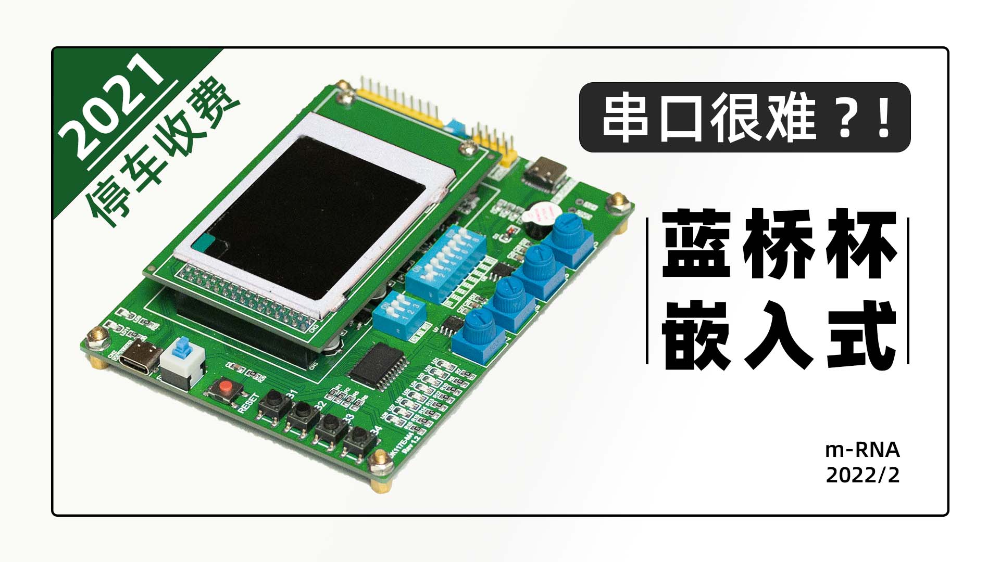
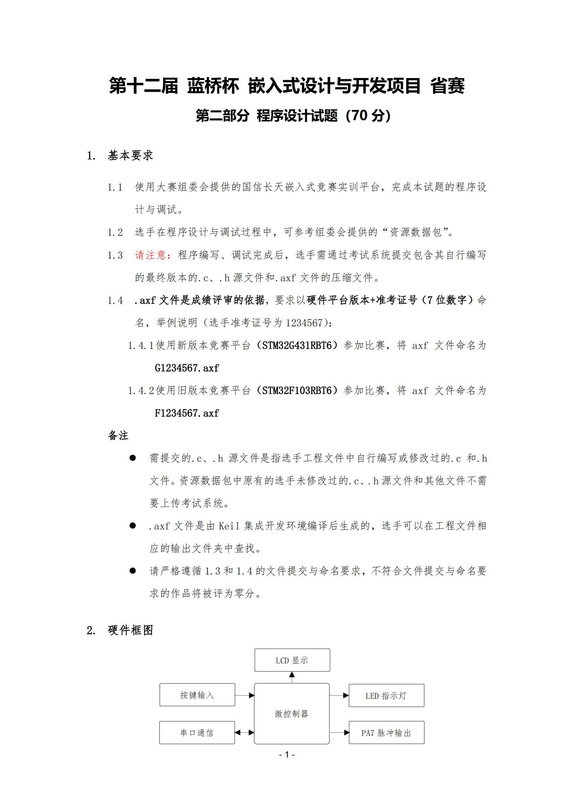
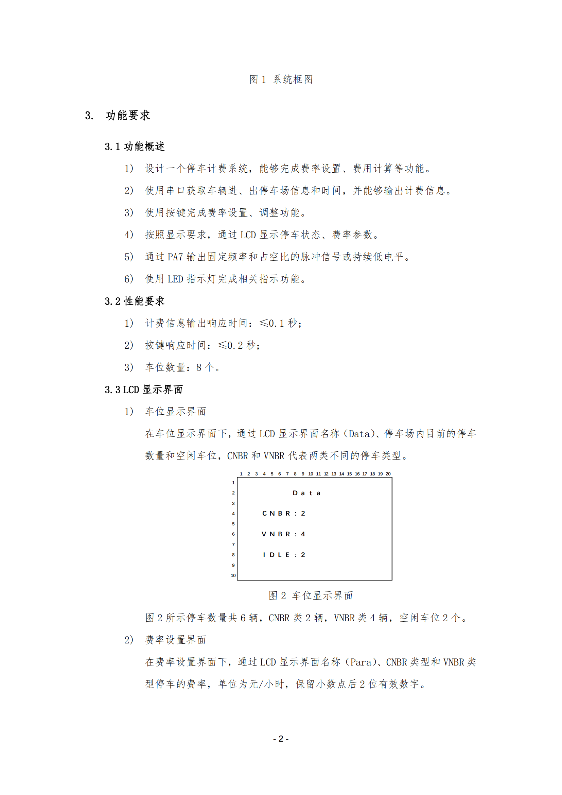
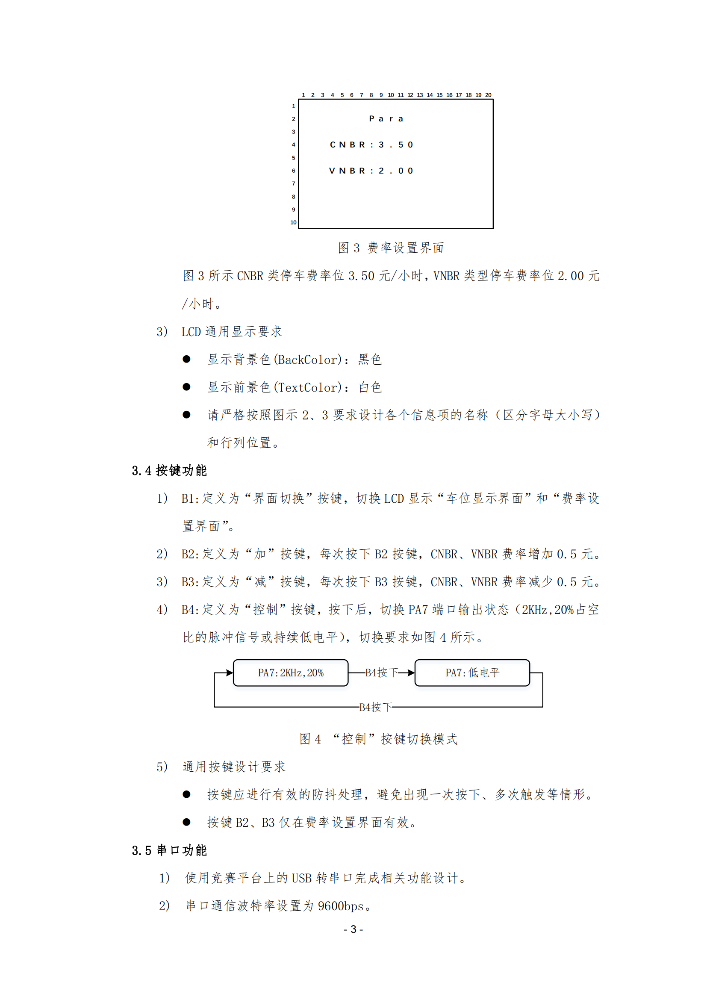
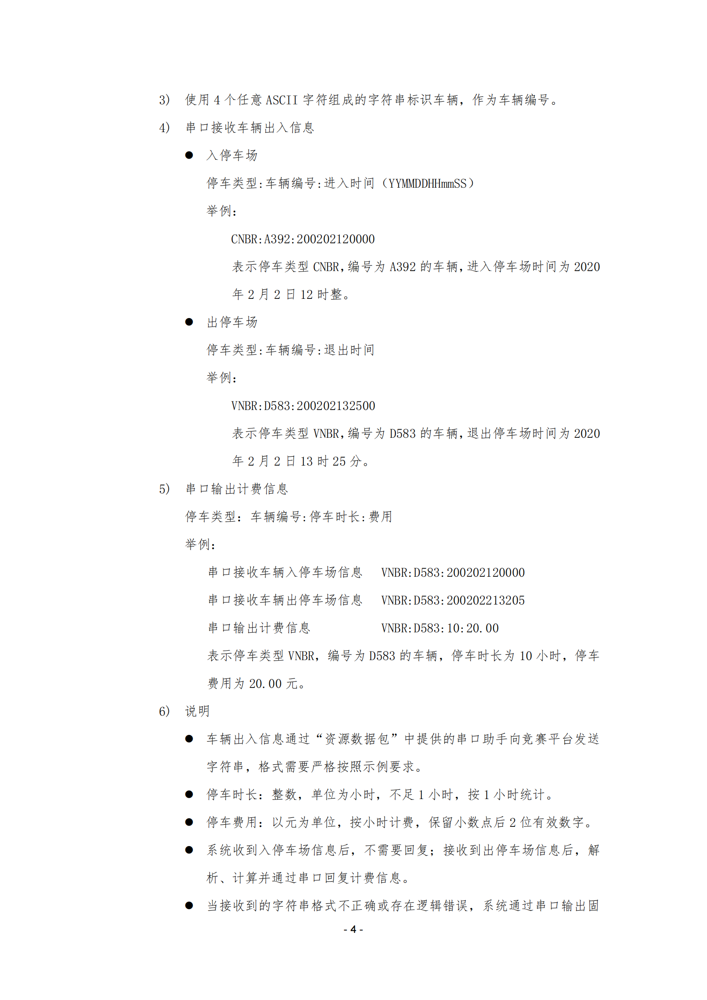
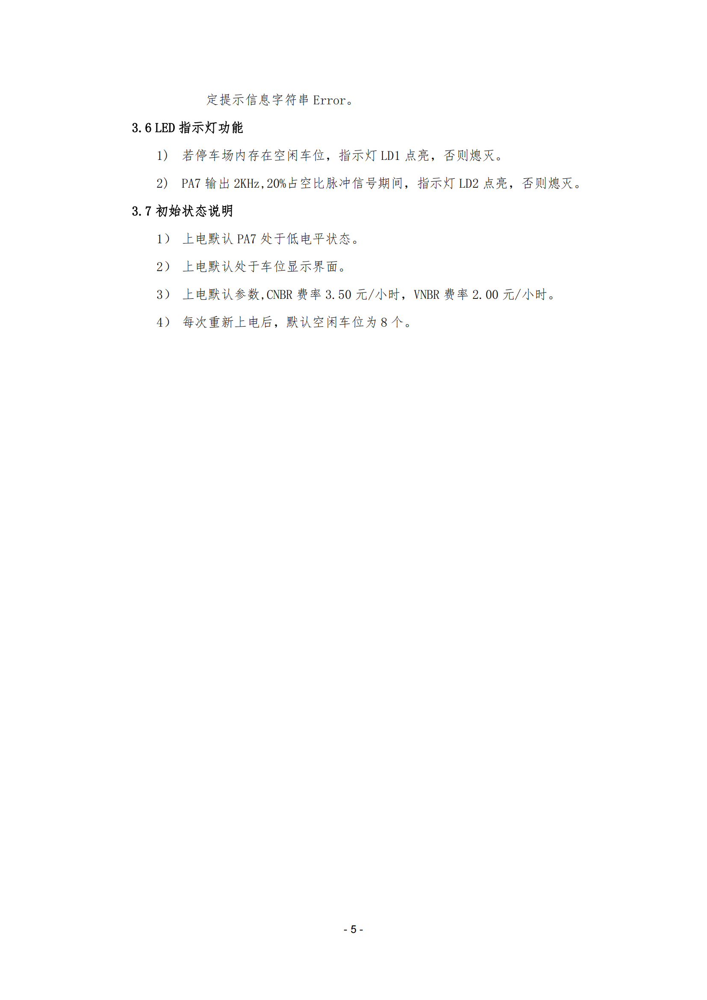

## 工程简介

2022/02/01  作者：[@BILIBILI：m-RNA](https://space.bilibili.com/41224928  "@BILIBILI：m-RNA 个人主页")    E-mail：m-RNA@qq.com      

[[哔哩哔哩: 蓝桥杯嵌入式省赛真题 停车收费系统 参考解析]](https://www.bilibili.com/video/BV1L3411E7xC)

分享理由：

- 本分享比大多数热心网友的分享**更加严谨且符合题意**；
- 由于**应用C语言标准库**也使得题目**更加简单**，**容错率也更高**；
- 本项目完全**免费**，不要被骗money💴了呀朋友。

## 题目要求

